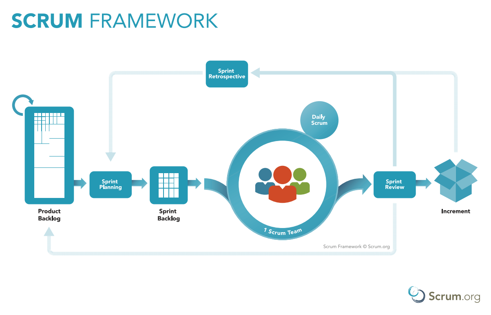

# Requirement Analysis

## Requirements Analysis

We performed some brainstorming sessions, and gathered the following requirements:

* Send an alert signal to selected contacts by pressing a sequence of Volume button.
	// TODO: Decide the sequence
* A confirmation dialog box will be shown from where the signal will be sent. In this dialog box, we can specify the following things:
	1. Header
	2. Customizable description
	3. Current location
	4. Start video or voice recording
	5. Call one of the selected contacts
	6. Call an ICE responder

	**4th** and **5th** can be toggled to turn the visibility in the dialog box. 	

* The alert can also be sent by opening the app manually.
* If the alert is successfully delivered to the receiver, the sender will get a haptic feedback.
* The receiver will get a notification on receiving the message and a dialog box which displays:
	- Alert message
	- Current location of the sender
	- A button for sending an acknowledgement to the sender.
	- Call back the sender
	- Call an ICE responder
* Maximum five contacts can be selected for alert.
* The alert will be sent through SMS and Internet.
* We can customize whether to call the contact or send an alert message.
* The app will also display an **Alert Log** about all the alerts sent and calls made.
* The instant alert service (through volume buttons) can also scheduled to prevent unintended volume button presses.
* When the service is running and a valid sequence is pressed, the system volume won't be affected.

## Problem Solving Techniques

To develop Securify, we will use the **bottom-up** (object oriented) approach as a problem solving technique. The two main resons why we chose this approach are:

1. The Android SDK is completely based on Java which is completely object oriented. The whole Android framework is a collection of classes.

2. Nowadays, the procedure-oriented or top-down approach is getting obsolete. It becomes easy to visualize a problem as a collection of real-world objects. When developing a complex system, such as the User Interface in case of Android&trade;, we can think of every drawable as an object, and then using the same baseline for deriving new views. 

## Project Life Cycle Model

For developing Securify, we think that agile development will be the most suitable. The requirements, in the context of our app, needs to be delivered as soon as possible, and then there are some features which aren't necessary in accordance to our primary scope.

The primary target would be to __send the alert message so that we can get help ASAP__. So we can develop our app in increments, with our primary target as the first increment.

Moreover, the requirements involve a considerable amount of real-life analyis, as the technology is evolving at a rapid phase and the security restrictions that Google is imposing on Android&trade;.

Looking at this rapid evolution, our main focus should be to deliver the product while adapting with the evolving technology and security.

So, we think that the best way to develop Securify, would be to go __agile__.

### Why Scrum?

We will be using **Scrum** as our agile development model. Scrum is one of the popular SDLC model and it meets our development criteria of being agile.

The following figure shows a brief overview of how Scrum works:

